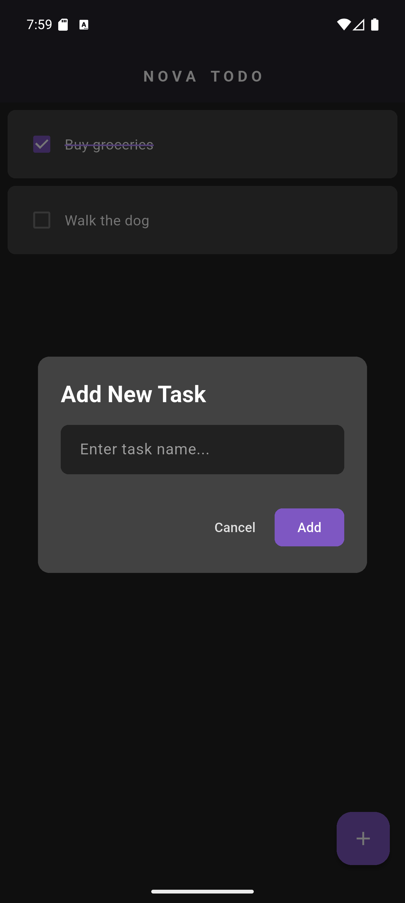

# N O V A   T O D O

A minimal, sleek, and modern To-Do application built with Flutter. N O V A features a beautiful dark mode UI with deep purple accents and fast local storage to keep track of your daily tasks seamlessly.

---

## 📸 Screenshots

<div align="center">
  
  
  
  
  
</div>

---

## ✨ Features

- **Modern UI:** Clean, distraction-free dark mode interface.
- **Task Management:** Easily add, cross off, and manage daily tasks.
- **Swipe Actions:** Intuitive swipe-to-delete functionality.
- **Local Storage:** Tasks are saved locally on your device and persist across app restarts.
- **Responsive:** Adapts naturally to different screen sizes.

---

## 🛠 Technologies & Tools

This project was built using the following technologies:

- **[Flutter](https://flutter.dev/)** - UI Toolkit for building natively compiled applications.
- **[Dart](https://dart.dev/)** - Programming language.
- **[Hive](https://pub.dev/packages/hive_flutter)** - A fast, lightweight, and completely local NoSQL database for Flutter.
- **[Flutter Slidable](https://pub.dev/packages/flutter_slidable)** - Used for the smooth swipe-to-delete list items.

---

## 🚀 Getting Started

Follow these steps to run the project locally on your machine.

### Prerequisites
- [Flutter SDK](https://docs.flutter.dev/get-started/install) installed
- An IDE like VS Code or Android Studio
- An active Android/iOS emulator or connected physical device

### Installation

1. Clone the repository:
   ```bash
   git clone https://github.com/a-agouzou/nova-todo.git
   ```
2. Navigate to the project directory:
   ```bash
   cd nova-todo
   ```
3. Install the required dependencies:
   ```bash
   flutter pub get
   ```
4. Run the app:
   ```bash
   flutter run
   ```